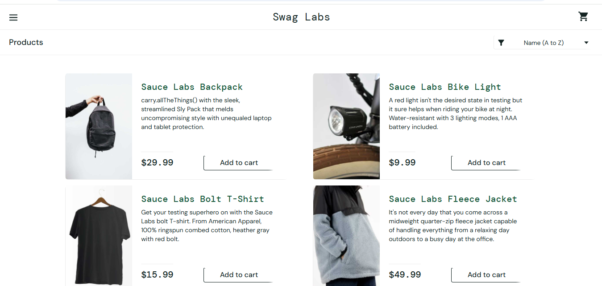

# Casos de Teste – Login

## CT-01 – Login com dados válidos
**Pré-condição:** Usuário cadastrado  
**Passos:**
1. Acessar a página de login
2. Inserir usuário válido
3. Inserir senha válida
4. Clicar em "Login"

**Resultado esperado:** Sistema deve permitir o acesso do usuário  
**Resultado obtido:** Login realizado com sucesso  
**Status:** Passou
### Evidência

---

## CT-02 – Login com senha inválida
**Pré-condição:** Usuário cadastrado  
**Passos:**
1. Acessar a página de login
2. Inserir usuário válido
3. Inserir senha inválida
4. Clicar em "Login"

**Resultado esperado:** Sistema deve exibir mensagem de erro informando credenciais inválidas  
**Resultado obtido:** Mensagem exibida corretamente  
**Status:** Passou
### Evidência

